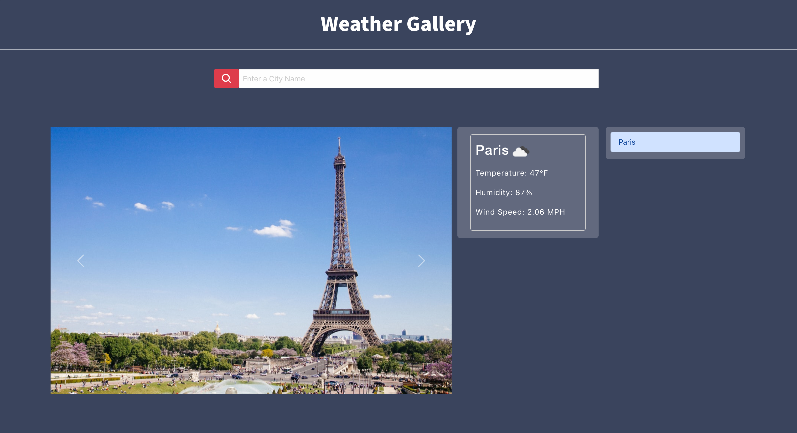

# Weather Gallery
This application allows the user to search for a city and get the current weather conditions as well as a fun 10 image gallery showing more or less how that city would look like in those conditions. The Unsplash Images API call takes in the city value and the Weather API "cloud condition" results as parameters. 

## Technology

The website was built using HTML, CSS and Javascript, Foundation, Bootsrap and JQuery.

## Pages

Single responsive page containing the interactive dashboard that includes a weather output as well as a carousel gallery.
https://jessicaramirezcalderon.github.io/weather-gallery/ 

## Contributing

Pull requests are welcome, but should be limited to improving the layout and styles. No special software is required to clone and run the website other than a basic code editor and a browser of choice. 

## License

MIT
